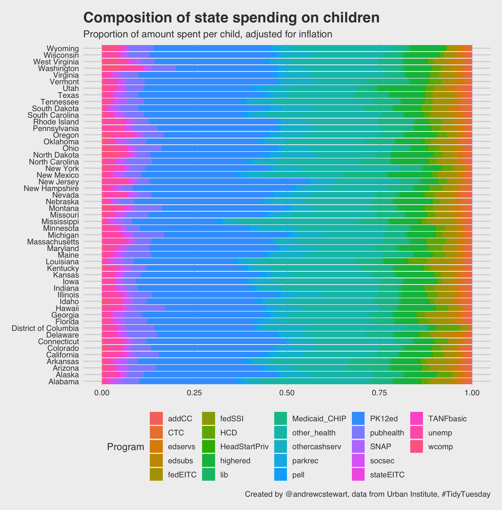
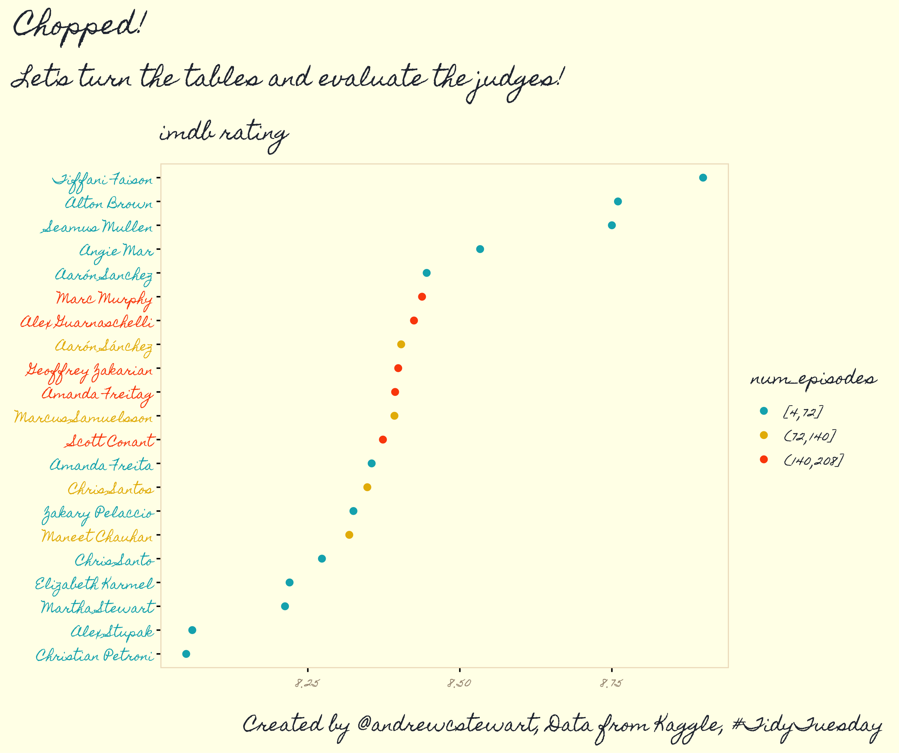
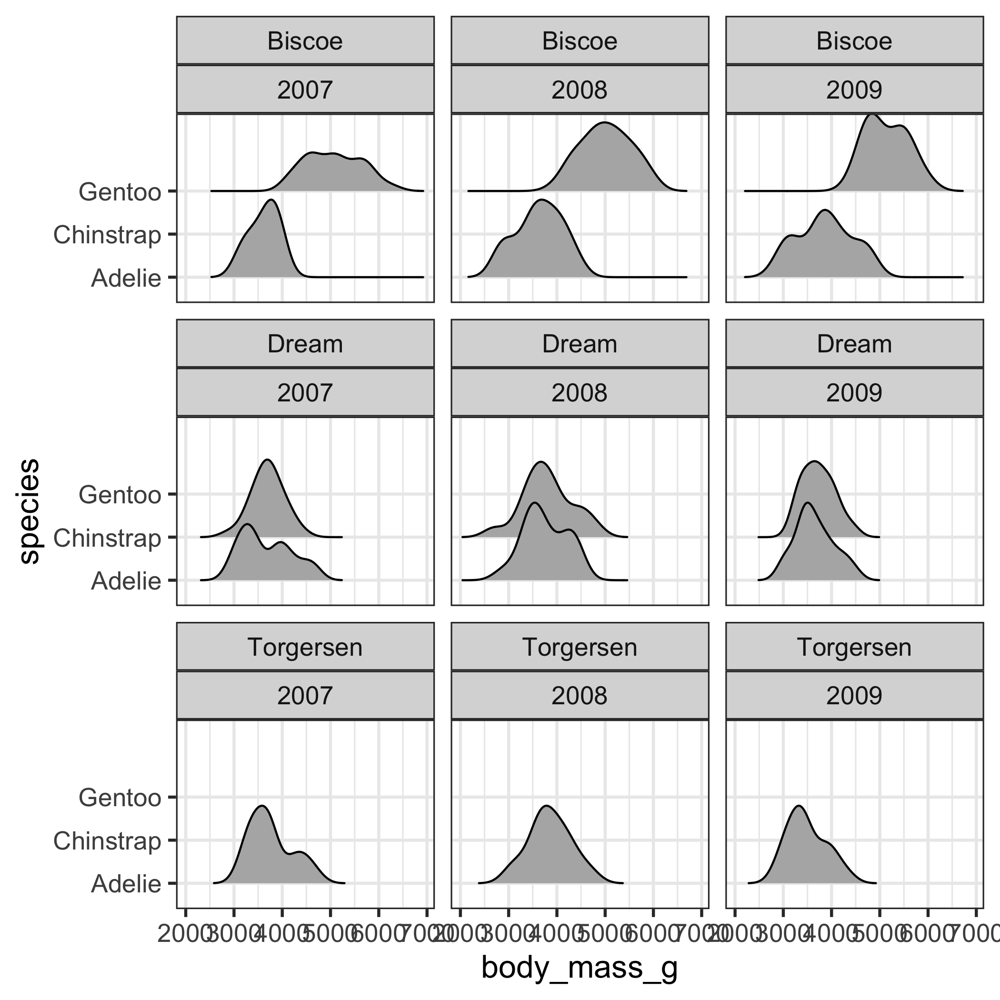

<!-- badges: start -->
  [](https://github.com/andrewcstewart/tidytuesdays/actions)
<!-- badges: end -->

```{r include=FALSE}
library(here)
library(fs)
library(pander)
```


# TidyTuesdays


## 2020-09-15



## 2020-09-08


## 2020-08-25 Chopped



## 2020-08-04 European Energy


## 2020-07-28 Penguins



## 2020-07-21 Animal Outcomes


## 2020-07-14 Astronauts


```{r eval=FALSE, fig.align='center', include=FALSE}
# walk directory tree
for (fig in fs::dir_ls(recurse = TRUE, glob = "*.png")) {
  print(fig)
  knitr::include_graphics(fig)
}
```

```{r eval=FALSE, include=FALSE}
knitr::include_graphics(fs::dir_ls(recurse = TRUE, glob = "*.png"))
```


```{r eval=FALSE, include=FALSE}
knitr::include_graphics(c("2020-08-04/final.png"))
print("hi")
knitr::include_graphics(c("2020-08-04/final.png"))
print("foo")
```


# Packages that I'm using

- [`futurevisions`](https://github.com/JoeyStanley/futurevisions)
- [`patchwork`](https://patchwork.data-imaginist.com/)
- [`waffle`](https://github.com/hrbrmstr/waffle)
- [`hrbrthemes`]()
- [`ggpubr`](https://github.com/kassambara/ggpubr)
- [`ggthemr`](https://github.com/cttobin/ggthemr)
- [`artyfarty`](https://datarootsio.github.io/artyfarty//index.html)
- [`ggpomological`](https://www.garrickadenbuie.com/project/ggpomological/)
- [`tvthemes`](https://ryo-n7.github.io/2019-05-16-introducing-tvthemes-package/)
- [`ggsci`](https://cran.r-project.org/web/packages/ggsci/vignettes/ggsci.html)
- [`sf`](https://r-spatial.github.io/sf/index.html)

# Fellow TidyTuesday folks I follow

- https://github.com/Z3tt/TidyTuesday
- https://github.com/jack-davison/TidyTuesday
- https://github.com/kellycotton/TidyTuesdays
- https://github.com/iandouglasbell/Tidy-Tuesdays
- https://github.com/beeb22/tidytuesday
