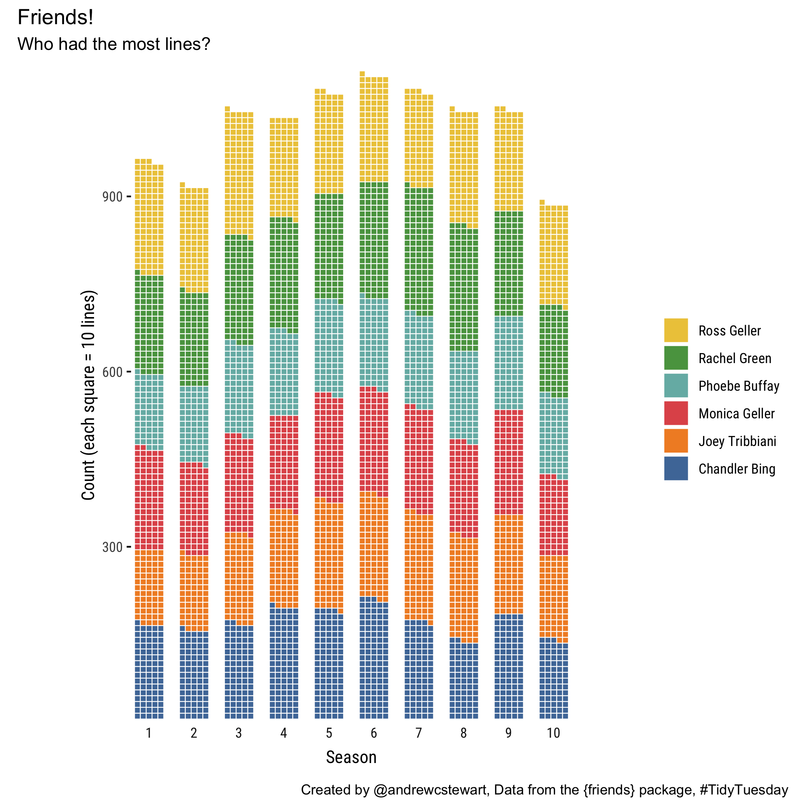
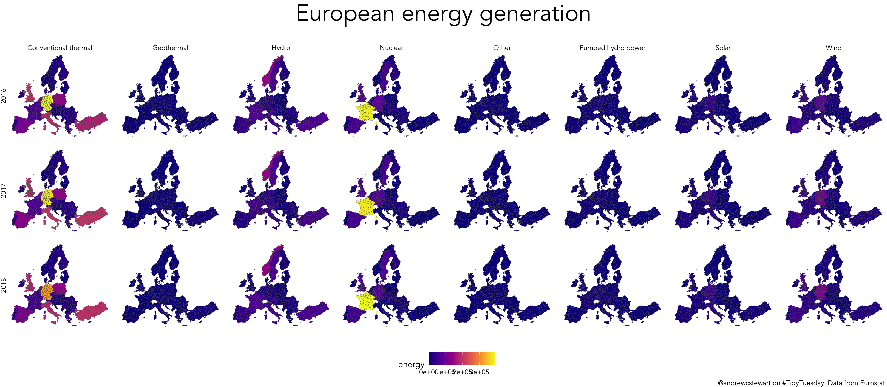

<!-- badges: start -->

<!-- badges: end -->

# TidyTuesdays

## 2020-09-15

## 2020-09-08

## 2020-08-25 Chopped

## 2020-08-04 European Energy

## 2020-07-28 Penguins

## 2020-07-21 Animal Outcomes

## 2020-07-14 Astronauts

# Packages that I’m using

  - [`futurevisions`](https://github.com/JoeyStanley/futurevisions)
  - [`patchwork`](https://patchwork.data-imaginist.com/)
  - [`waffle`](https://github.com/hrbrmstr/waffle)
  - [`hrbrthemes`]()
  - [`ggpubr`](https://github.com/kassambara/ggpubr)
  - [`ggthemr`](https://github.com/cttobin/ggthemr)
  - [`artyfarty`](https://datarootsio.github.io/artyfarty//index.html)
  - [`ggpomological`](https://www.garrickadenbuie.com/project/ggpomological/)
  - [`tvthemes`](https://ryo-n7.github.io/2019-05-16-introducing-tvthemes-package/)

# Fellow TidyTuesday folks I follow

  - <https://github.com/Z3tt/TidyTuesday>
  - <https://github.com/jack-davison/TidyTuesday>
  - <https://github.com/kellycotton/TidyTuesdays>
  - <https://github.com/iandouglasbell/Tidy-Tuesdays>
  - <https://github.com/beeb22/tidytuesday>
